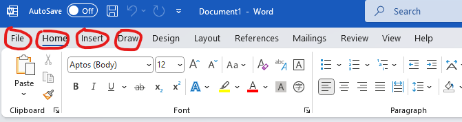
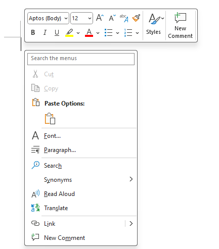
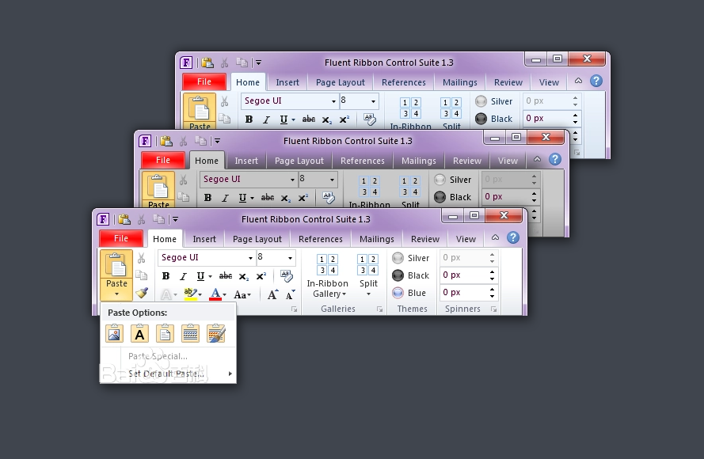

# Model 3 Vocabularies

## 键鼠操作

### click

v. 鼠标点击

double click	双击

### press

v. 按下按键

### hold down

v. 持续按住按键

### highlight

v. 选择文本（一般不这么说，因为 highlight 可以是文本高亮的意思，袋鼠比较猎奇）

### copy

v. 复制

### paste

v. 黏贴

### insert

v. 插入，插入文本

## 大小写字母

### capital letter

大写字母

同义词：uppercase

### small letter

小写字母

同义词：lowercase

## 软件界面

### cursor

n. 鼠标光标

### tab

如图，一个个红圈里的就是 tab。

注意和键盘上的 <tab> 键区分开。

### menu

鼠标右键点出来的玩意。

### ribbon

（图片来自百度百科）

说白了这里和 `tab` 意思相同。

ribbon 是挺专业冷门的一个词汇，袋鼠无敌了。

百度百科相关链接：https://baike.baidu.com/item/Ribbon/17568

### pane

n. 窗格

## 字体样式

### format

v. 设置字体样式

n. 样式

### font

n. 字体

### font size

n. 字号

### font style

n. 字体样式

### bold

adj. 加粗

### italic

adj. 斜体

### underline

adj. 下划线

### alignment

n. 字体布局

常见的有 居左（left），居中（center），居右（right）